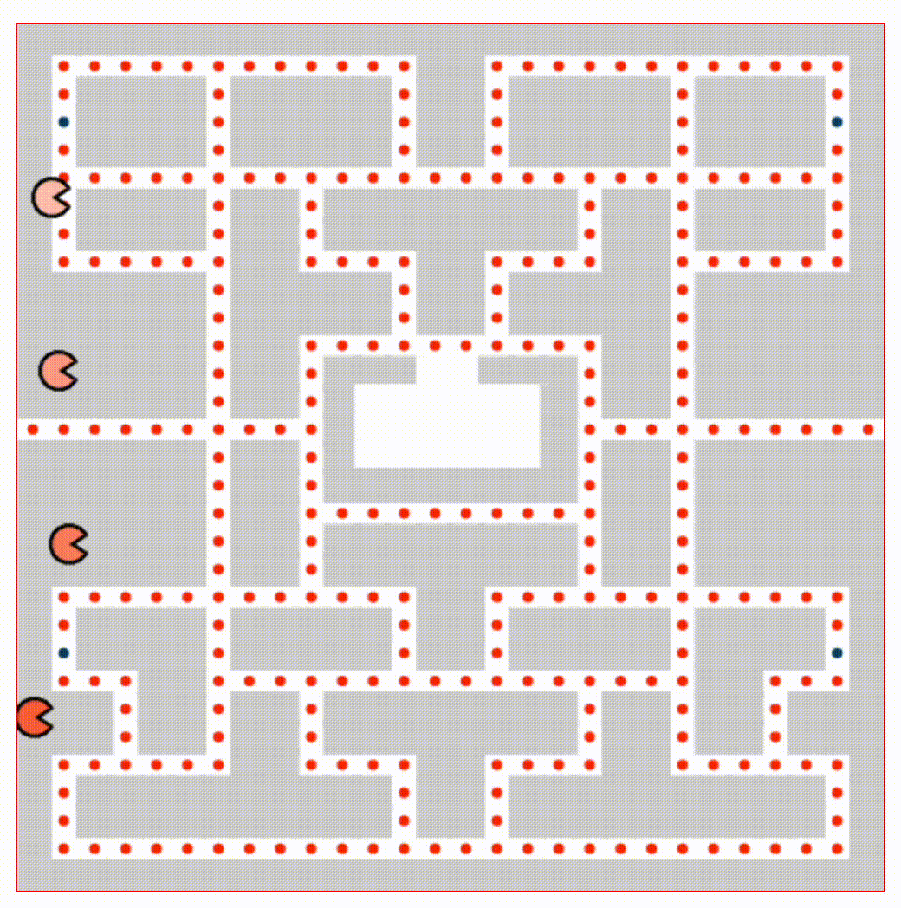

<a href="https://www.coreof.tech/" target="_blank">
  
</a>

# Exercises W4D3 - Canvas

Sobre el código del Pacman creado en clase vamos a hacer un par de añadidos: `keyUp` y `keyDown` para que Pacman se desplace por el eje de las Y y pintaremos un laberinto como imagen de fondo del canvas.

## 1. More katas!?

¡It´s Kata-Time!


- [Calculating with Functions](https://www.codewars.com/kata/525f3eda17c7cd9f9e000b39/train/javascript)
- [Take a Ten Minute Walk](https://www.codewars.com/kata/54da539698b8a2ad76000228)

## 2. Y axis on Pacman

En esta misma carpeta encontrarás el PACMAN realizado en clase. No obstante aún no es capaz de detectar las teclas `keyUp` y `keyDown`. Al pulsarlas, PACMAN debe dejar de desplazarse por el eje de las X y empezar a desplazarse por el eje de las Y de manera automática. No olvides revisar su `direction` para que la boca vaya siempre hacia el lado correcto del movimiento.


## 3. Pacman`s map

Una vez completado el ejercicio anterior, añade un nuevo actor a tu juego: el mapa. Sigue la información definida en la variable `pacmanMap` de la `class Map {(...)}` y pinta un laberinto en el fondo de tu canvas.

Use the class MAP define in actor´s folder, loop through `let pacmanMap` and draw separete elements with:

- ctx.fillStyle();
- ctx.fillRect();
- ctx.strokeStyle();
- ctx.strokeRect();

- ctx.beginPath();
- ctx.arc();
- ctx.fill();

¡Recuerda! El laberinto se comportará como una imagen de fondo: por ahora, tus pacman no interactuarán con ella. Observa el resultado esperado en la siguiente imagen:



## 4. Entrega

Puedes hacer copy&paste del código de tus KATAS en el siguiente espacio y completar el resto de ejercicios en sus respectivos archivos. Después, haznos una pullrequest al repositorio de CORE.

```js

```

## References

- [String.prototype.split()](https://developer.mozilla.org/es/docs/Web/JavaScript/Reference/Global_Objects/String/split)
- [CanvasRenderingContext2D.strokeRect()](https://developer.mozilla.org/en-US/docs/Web/API/CanvasRenderingContext2D/strokeRect)
- [CanvasRenderingContext2D.arc()](https://developer.mozilla.org/es/docs/Web/API/CanvasRenderingContext2D/arc)
